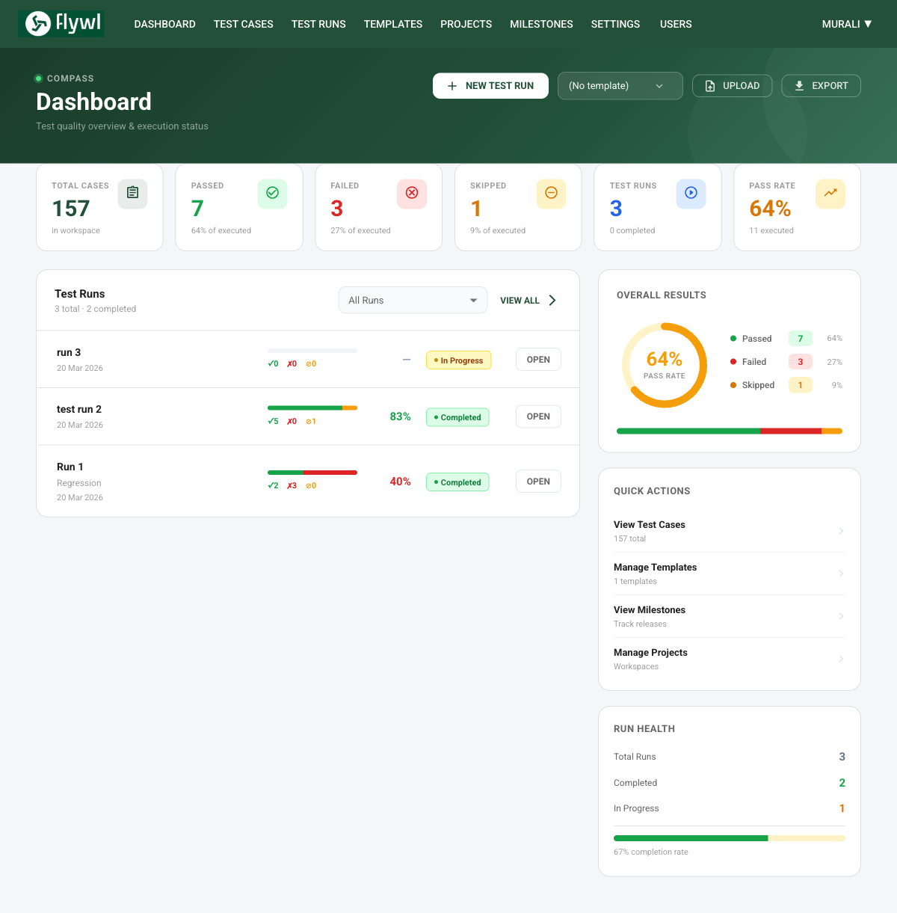
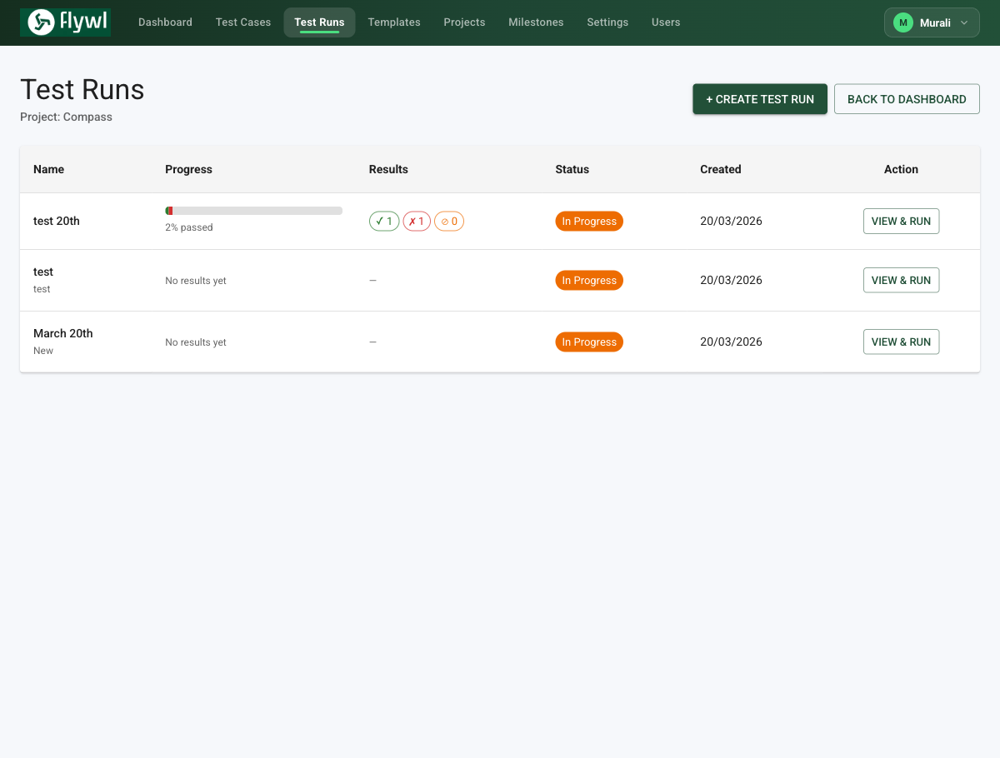
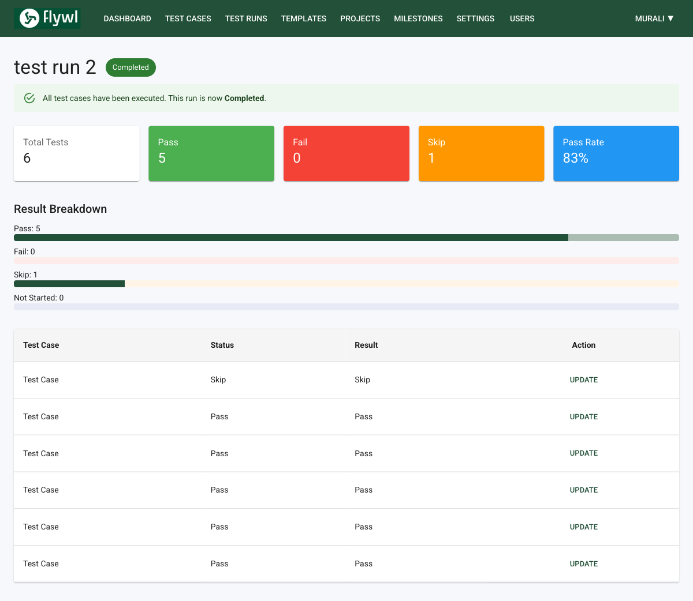
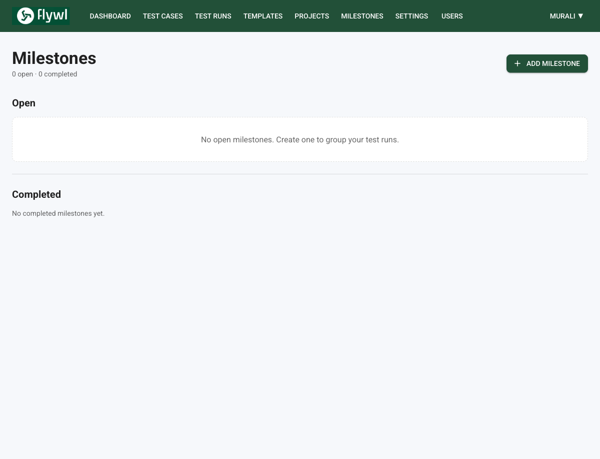
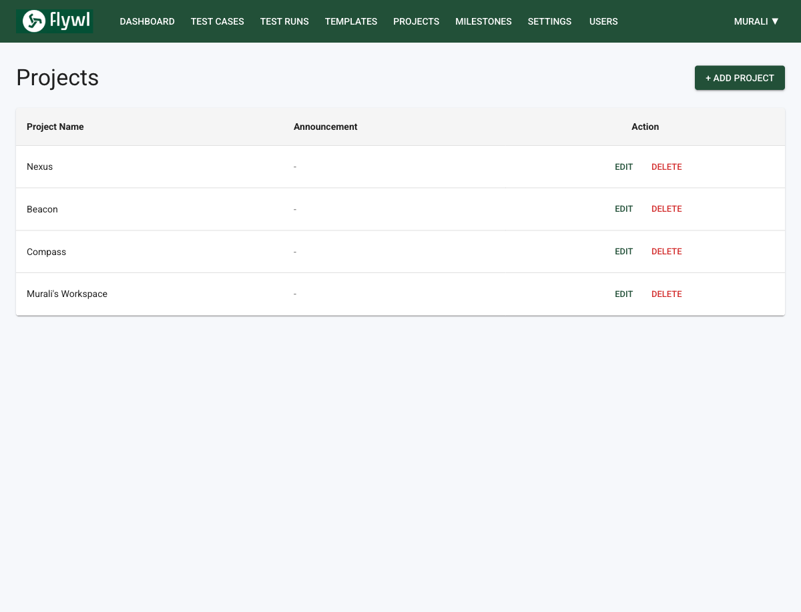
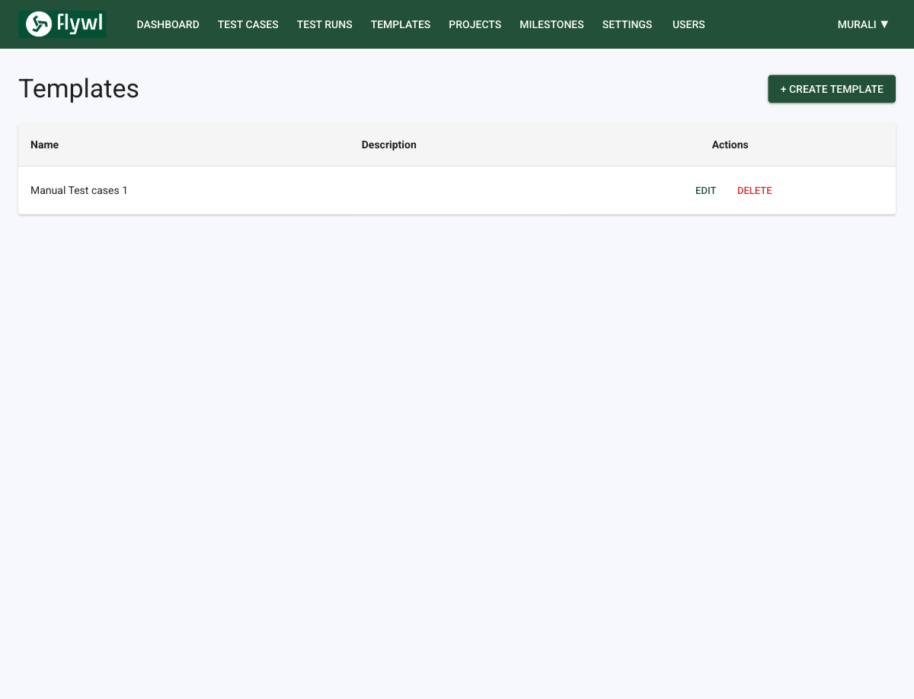
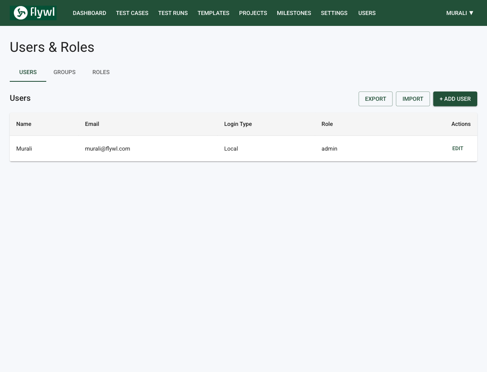
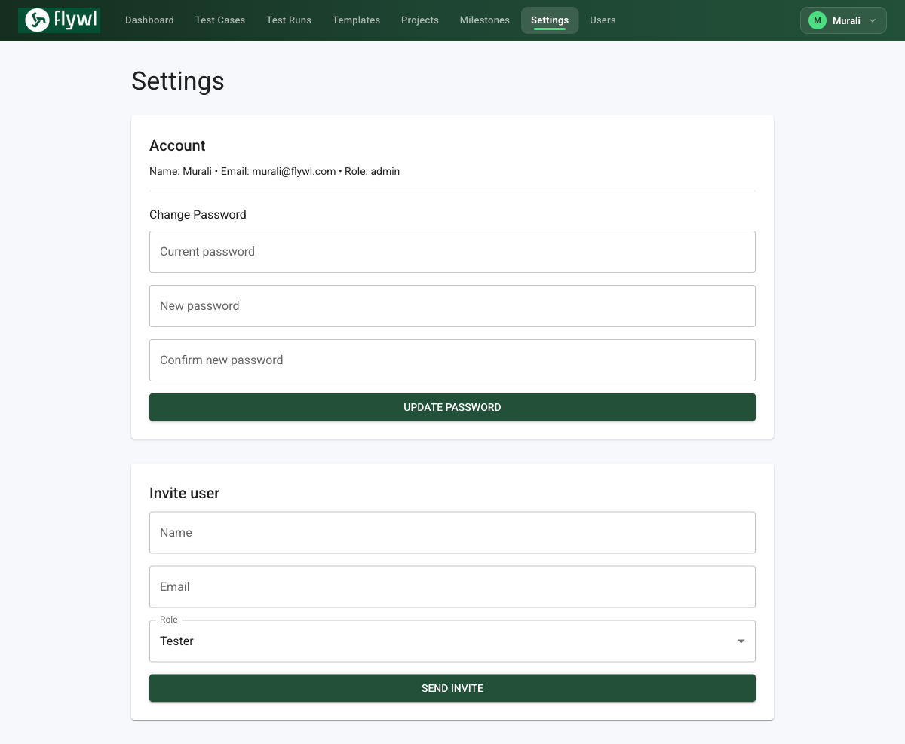
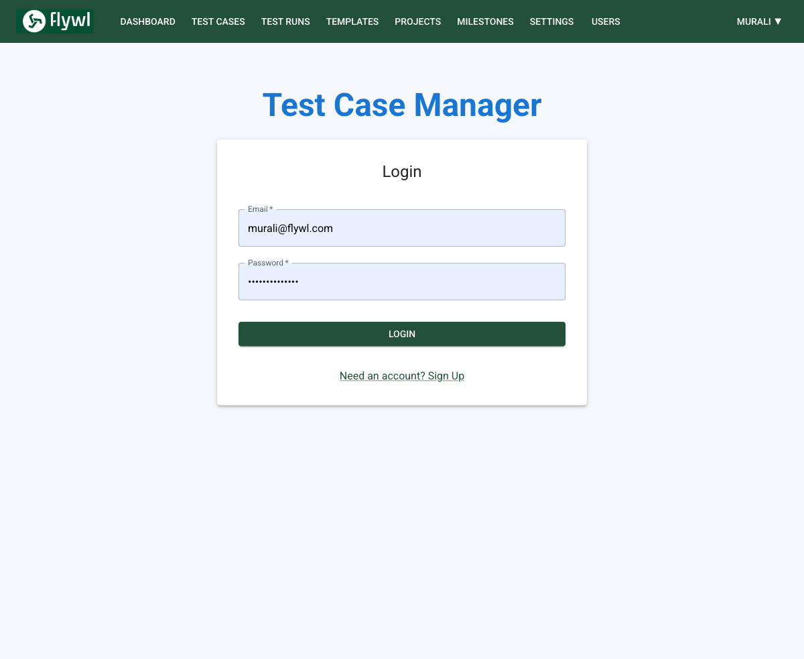

# Flywl — Test Case Management Tool

A comprehensive TestRail-style test case management tool built with React, Node.js, and PostgreSQL. Built for QA teams to manage test cases, execute test runs, track milestones, and analyse quality metrics.

## Screenshots

| Dashboard | Test Cases |
|-----------|------------|
|  |

| Test Runs | Test Run Detail |
|-----------|----------------|
|  |  |

| Milestones | Projects |
|------------|----------|
|  |  |

| Templates | Users & Roles |
|-----------|---------------|
|  |  |

| Settings | Login |
|----------|-------|
|  |  |

## Features

✅ **User Management**
- Signup/Login with JWT authentication
- Role-based access control (Admin, QA Lead, Tester)
- Groups & Roles management with CSV import/export
- Team/Workspace management with multi-project support

✅ **Test Case Management**
- Create, edit, delete, and clone test cases with TC-ID tracking
- Custom test case templates with JSONB field support
- Bulk upload via CSV/Excel with column mapping preview
- Bulk download (Excel, CSV)
- Full edit history with version tracking
- Automation flag toggle per test case (manual/automated)
- Search, filter by priority/status/template, bulk edit & bulk delete

✅ **Test Execution**
- Create and manage test runs per project
- Mark pass/fail/skip with comments
- Real-time progress bar and pass rate tracking
- Milestone linking for release-based test planning

✅ **Dashboard & Analytics**
- Release Readiness score (coverage × quality × critical tests)
- Pre-Release Checklist auto-generated from test data
- Pass Rate Trend chart across last 8 test runs
- Execution Velocity (executions per day, last 14 days)
- Coverage Heatmap by priority level
- Test Debt Monitor with health score
- Flaky Test Radar and Most Failing Tests
- Automation Coverage by project with live refresh
- Milestone Risk tracking for upcoming releases

✅ **CI/CD Integration Ready**
- API-first architecture
- Workspace-scoped data isolation
- Dedicated `/reports/automation` endpoint for CI dashboards

## Tech Stack

- **Frontend**: React 18 + Material-UI
- **Backend**: Node.js + Express.js
- **Database**: PostgreSQL
- **Storage**: Local/S3 for file uploads
- **Authentication**: JWT
- **Deployment**: Docker + Docker Compose + Nginx

## Quick Start Locally

### Prerequisites
- Node.js (v18+)
- PostgreSQL (v12+)
- Docker & Docker Compose (optional but recommended)

### Without Docker

1. **Setup Database**
```bash
createdb test_case_tool
psql test_case_tool < migrations/schema.sql
```

2. **Backend Setup**
```bash
cd backend
npm install
cp .env.example .env
# Edit .env with your database credentials
npm run migrate
npm run dev
```

3. **Frontend Setup**
```bash
cd frontend
npm install
npm start
```

Visit `http://localhost:3000`

### With Docker (Recommended)

```bash
# Clone and enter directory
cd test-case-tool

# Create .env file
cp .env.example .env
# Edit .env as needed

# Start everything
docker-compose up -d

# Run migrations
docker-compose exec backend npm run migrate

# Access application
# Frontend: http://localhost:3000
# Backend API: http://localhost:5000/api
```

## Deployment to DigitalOcean

### Step 1: Create DigitalOcean Account & Droplet

1. Sign up at [DigitalOcean](https://www.digitalocean.com)
2. Create a new Droplet:
   - Image: Ubuntu 22.04 LTS
   - Size: $4/month (1GB RAM, 1vCPU)
   - Region: Nearest to your location
3. Create PostgreSQL database:
   - Type: Managed PostgreSQL
   - Version: 15
   - Plan: $15/month
4. Configure firewall to allow:
   - SSH (22)
   - HTTP (80)
   - HTTPS (443)

### Step 2: Connect to Droplet

```bash
ssh root@YOUR_DROPLET_IP
```

### Step 3: Install Dependencies

```bash
# Update system
apt-get update && apt-get upgrade -y

# Install Docker & Docker Compose
apt-get install -y docker.io docker-compose git

# Start Docker
systemctl start docker
systemctl enable docker
```

### Step 4: Deploy Application

```bash
# Clone project
git clone <your-repo-url>
cd test-case-tool

# Create .env file
cat > .env << EOF
DB_HOST=<your-managed-db-host>
DB_PORT=5432
DB_NAME=test_case_tool
DB_USER=doadmin
DB_PASSWORD=<your-db-password>
JWT_SECRET=$(openssl rand -base64 32)
PORT=5000
NODE_ENV=production
UPLOAD_DIR=./uploads
EOF

# Create uploads directory
mkdir -p uploads

# Build and start with Docker
docker-compose up -d

# Run migrations using psql
PGPASSWORD='<your-db-password>' psql -h <your-db-host> -U doadmin -d test_case_tool < backend/src/migrations/initDatabase.sql
```

### Step 5: Setup Domain & SSL

```bash
# Install Certbot for Let's Encrypt
apt-get install -y certbot python3-certbot-nginx

# Get SSL certificate
certbot certonly --standalone -d your-domain.com -d www.your-domain.com

# Update nginx.conf with your domain
nano nginx.conf
# Uncomment HTTPS sections and update server_name

# Restart containers with new config
docker-compose restart nginx
```

### Step 6: Monitor & Maintain

```bash
# View container logs
docker-compose logs -f backend
docker-compose logs -f frontend
docker-compose logs -f postgres

# Backup database
pg_dump -h <host> -U <user> -d test_case_tool > backup.sql

# Update application
git pull
docker-compose rebuild
docker-compose up -d
```

## API Documentation

### Authentication
```
POST /api/auth/signup
POST /api/auth/login
GET /api/auth/profile
```

### Test Cases
```
GET    /api/test-cases
POST   /api/test-cases
GET    /api/test-cases/:id
PUT    /api/test-cases/:id
DELETE /api/test-cases/:id
POST   /api/test-cases/:id/clone
```

### Test Runs
```
GET    /api/test-runs
POST   /api/test-runs
GET    /api/test-runs/:id
PUT    /api/test-runs/:id/status
PUT    /api/test-runs/result/:id
```

### Templates
```
GET    /api/templates
POST   /api/templates
GET    /api/templates/:id
PUT    /api/templates/:id
DELETE /api/templates/:id
```

### Reports
```
GET /api/reports/metrics
GET /api/reports/audit-log
GET /api/reports/history/:testCaseId
```

### Upload/Download
```
POST /api/upload/upload
GET  /api/upload/download/excel
GET  /api/upload/download/csv
```

## Project Structure

```
test-case-tool/
├── backend/
│   ├── src/
│   │   ├── config/          # Database config
│   │   ├── controllers/      # Business logic
│   │   ├── middleware/       # Auth & other middleware
│   │   ├── migrations/       # Database schema
│   │   ├── routes/           # API routes
│   │   └── index.js          # Entry point
│   ├── package.json
│   └── .env.example
│
├── frontend/
│   ├── src/
│   │   ├── pages/            # React pages
│   │   ├── services/         # API calls
│   │   ├── App.js
│   │   └── index.js
│   ├── public/
│   └── package.json
│
├── Dockerfile.backend
├── Dockerfile.frontend
├── docker-compose.yml
├── nginx.conf
└── README.md
```

## Database Schema

### Users Table
- id, email, password, name, role, workspace_id, created_at, updated_at

### Workspaces Table
- id, name, owner_id, created_at, updated_at

### Templates Table
- id, workspace_id, name, description, fields (JSONB), is_default, created_by, created_at, updated_at

### Test Cases Table
- id, workspace_id, template_id, title, description, steps, expected_result, priority, status, created_by, created_at, updated_at

### Test Case Versions Table (for edit history)
- id, test_case_id, version_number, title, description, steps, expected_result, priority, changed_by, change_reason, created_at

### Test Runs Table
- id, workspace_id, name, description, status, created_by, created_at, updated_at

### Test Results Table
- id, test_run_id, test_case_id, assigned_to, status, result, comments, attachments, executed_at, created_at, updated_at

### Audit Log Table
- id, workspace_id, user_id, action, entity_type, entity_id, old_value, new_value, created_at

## Security Considerations

1. **Change Default JWT Secret**
   ```bash
   JWT_SECRET=$(openssl rand -base64 32)
   ```

2. **Use Strong Database Password**
   - Generate: `openssl rand -base64 32`

3. **Set up HTTPS with Let's Encrypt**
   - Required for production

4. **Regular Database Backups**
   - Automated backups recommended

5. **Keep Dependencies Updated**
   ```bash
   npm audit fix
   docker pull ubuntu:22.04
   ```

## Troubleshooting

### Port 5000 already in use
```bash
lsof -i :5000
kill -9 <PID>
```

### Database connection error
```bash
# Check PostgreSQL is running
docker-compose ps
docker-compose logs postgres

# Verify credentials in .env
cat .env
```

### Docker compose permission denied
```bash
sudo usermod -aG docker $USER
```

### CORS errors
Update `ALLOWED_ORIGINS` in `.env`

## Performance Tips

1. **Database Indexes**: Already created for commonly searched fields
2. **Pagination**: Implement for large datasets
3. **Caching**: Add Redis for session management
4. **CDN**: Use CloudFront/Cloudflare for static assets

## Scaling for Large Teams

1. **Load Balancing**: Add multiple backend instances
2. **Database**: Upgrade to managed PostgreSQL with read replicas
3. **File Storage**: Migrate to AWS S3
4. **Message Queue**: Add Redis for background jobs
5. **Monitoring**: Add Prometheus + Grafana

## Support & Documentation

- API Documentation: Open http://localhost:5000/api/health
- Frontend Health: Open http://localhost:3000
- Database Logs: `docker-compose logs postgres`

## License

MIT License

## Author

Built for QA teams | 2024
